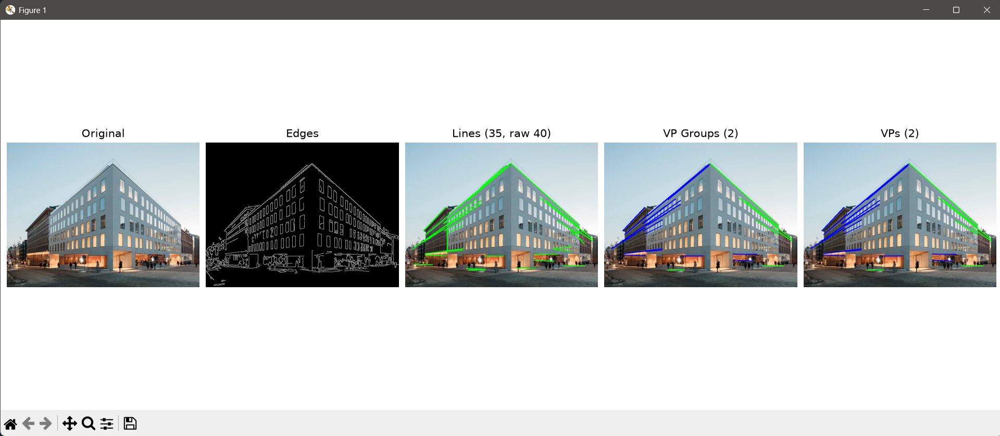
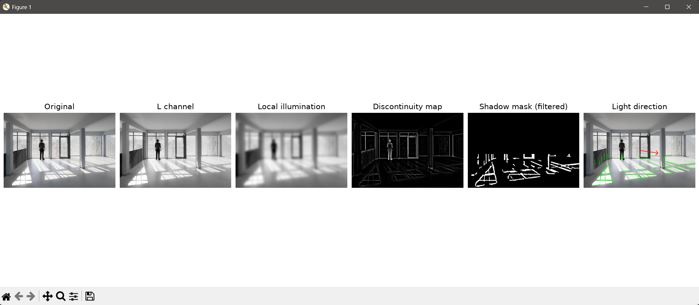

# Physics Forensics

A physics-guided image forensics toolkit inspired by Hany Farid's Photo Forensics lectures.

## Planned Features

- Perspective and Vanishing Point analysis
- Lighting Consistency analysis
- Shadow Consistency analysis
- Reflection analysis
- Noise Consistency analysis
- JPEG Artifact analysis
- Explainable ML-based authenticity scoring

# Perspective Analysis

The perspective module detects **structural line convergence** in an image and uses vanishing-point geometry to determine whether the scene exhibits consistent perspective. It is intended for photo-forensic analysis, where perspective inconsistencies can indicate manipulation.

## Processing Pipeline

1. **Preprocessing**

   * Converts the image to grayscale.
   * Applies a `5×5` Gaussian blur to suppress small-scale noise before edge detection, since perspective analysis depends on long structural edges, not pixel-level texture.

2. **Adaptive Canny Edge Detection**

   * Uses **Otsu's threshold** to determine the Canny high threshold automatically; the low threshold is set to `0.5 × high`. Fixed thresholds perform poorly across images with different brightness and contrast, so Otsu adapts to the image's intensity distribution instead.

3. **Probabilistic Hough Line Detection**

   * Detects straight edge segments using `HoughLinesP`.
   * `minLineLength` is scaled to `7%` of the image diagonal and `maxLineGap` to `1%`, since scaling these parameters with image size prevents small images from being over-filtered and large images from producing excessive short/noisy lines.

4. **Duplicate Line Merging**

   * Lines with similar orientation (`<3°`) and nearby midpoints are grouped, keeping the longest segment. A single physical edge can generate multiple overlapping Hough segments, and without merging, one edge could be incorrectly counted several times and dominate the analysis.

5. **Homogeneous Line Representation**

   * Each detected line is converted to a homogeneous line using the cross product of its two endpoints.
   * Two lines are intersected using another cross product. Homogeneous coordinates provide a standard projective-geometry representation and allow vanishing points to be calculated directly from line intersections.

6. **Vanishing Point Detection — RANSAC**

   * Candidate vanishing points are generated from intersections of line pairs.
   * A candidate is considered supported when other lines pass within **6 px** of that point.
   * Up to **300** line-pair samples are tested per RANSAC pass.
   * The winning VP maximizes the **total pixel length of its inlier lines**, rather than simply counting lines, since long structural edges such as building edges, road boundaries, and rails are more meaningful than numerous short texture edges.

7. **Sequential Multi-Vanishing-Point Detection**

   * After finding a dominant VP, its inlier lines are removed and the process is repeated, allowing up to **5 VPs**, since real scenes can contain multiple perspective directions, such as the horizontal and vertical axes of a building.

8. **Scene Applicability Gating**

   * Analysis requires at least **6 merged lines**.
   * If line density exceeds `0.006 lines/pixel`, the scene is treated as likely texture-heavy and marked **Not applicable**. Grass, foliage, gravel, and similar textures can generate many meaningless short lines, so the module avoids forcing a perspective conclusion when reliable structural geometry is absent.

## Perspective Score

The score measures the fraction of detected **edge length** explained by the detected vanishing points:

```text
Perspective Score =
    total length of VP-inlier lines
    ───────────────────────────────
       total detected line length
```

This makes the score **length-weighted** rather than line-count based. A few long converging structural edges therefore carry more significance than many short texture edges.

| Score          | Interpretation                                             |
| -------------- | ---------------------------------------------------------- |
| `≥ 0.50`       | **Consistent** — strong convergence to reliable VP(s)      |
| `0.25–0.49`    | **Mixed** — partial convergence with unexplained structure |
| `< 0.25`       | **Inconsistent** — little reliable perspective convergence |
| Not applicable | Insufficient or texture-dominated structural geometry      |

## Outputs

The analyzer returns:

* `edges` — Canny edge map
* `lines` — detected and deduplicated structural lines
* `groups_image` — lines grouped by detected VP
* `vanishing_points` — final VP visualization
* `num_lines` / `raw_line_count` — effect of line deduplication
* `num_vanishing_points` — detected perspective directions
* `vps` — VP coordinates, confidence, inlier count and inlier length
* `perspective_score` — length-weighted convergence score
* `perspective_interpretation` — human-readable forensic interpretation
* `applicable` — whether the scene contains sufficient structural geometry

### Example Run



Panels left to right: `Original`, `Edges`, `Lines (35, raw 40)`, `VP Groups (2)`, `VPs (2)`.

* **Edges** are sparse and are confined to the building's window grid, roofline and street-level storefront. This is Otsu-adaptive Canny doing its job on a high-contrast facade. There is almost no noise from the sky or the blurred crowd at street level, since the `5×5` blur suppressed that texture before edge detection ran.
* **Lines (35, raw 40)** shows the drop from 40 raw Hough segments to 35 after duplicate merging. The window rows in particular tend to fire multiple overlapping Hough segments per row, and the `<3°` / nearby-midpoint merge collapses those into single lines.
* **VP Groups (2)** colours the lines by which vanishing point claimed them: green picks up the roofline and window-row edges receding to the right, blue picks up the vertical corner edges and the storefront line receding to the left. Two clear facades of the building produce two distinct convergence directions.
* **VPs (2)** is the final overlay once RANSAC has picked the two winning intersections and re-associated all inlier lines to them — the fact that almost every merged line ends up green or blue (few gray/unassigned lines) is why this scene scores in the `Consistent` band: most of the detected edge length is explained by only two VPs.

# Illumination Analysis

The illumination module detects **shadow regions and their dominant direction**, then estimates the corresponding **light-source direction** from local brightness. It is intended for photo-forensic analysis, where inconsistent shadow and illumination geometry can indicate possible manipulation.

## Processing Pipeline

1. **Preprocessing**
   - Converts the image to **LAB** color space and extracts the `L` (lightness) channel.
   - Applies a `5×5` Gaussian blur to the `L` channel.
   - Converts the image to HSV for optional hue filtering.
   - The `L` channel provides an illumination-focused representation while the blur reduces small-scale noise.

2. **Local Illumination Estimation**
   - Applies a large Gaussian blur using a default `61×61` kernel.
   - Produces a smooth estimate of the surrounding illumination.
   - This separates broad illumination variation from local objects and shadow boundaries.

3. **Illumination Discontinuity Map**
   - Computes the difference between local illumination and the original `L` channel:

```text
   Discontinuity = Local illumination − L channel
```

   * Negative values are clipped to zero.
   * This highlights regions that are darker than their local surroundings and can therefore correspond to shadows.

4. **Adaptive Shadow Candidate Detection**

   * Uses Gaussian adaptive thresholding with a default `51×51` local window and `C = 8`.
   * Restricts the detected candidates to the lower `45%` of the image using a floor ROI.
   * Local thresholding allows shadow detection to adapt to changing illumination instead of applying one global brightness threshold.

5. **Morphological Cleanup**

   * Applies morphological **opening** followed by **closing** using a `5×5` kernel.
   * Opening removes small isolated regions, while closing fills small gaps and connects nearby parts of shadow regions.

6. **Shadow Component Filtering**

   * Connected components are filtered using:

     * Minimum area: `150 px`
     * Maximum aspect ratio: `6.0`
     * Minimum extent: `0.15`
     * Maximum border-touch fraction: `0.6`
   * These constraints remove small, sparse, highly elongated, or image-border-connected regions that are less suitable as shadow candidates.

7. **Optional Hue-Invariance Filtering**

   * Compares each pixel's HSV hue with a locally blurred hue estimate.
   * Pixels with a hue difference greater than `12°` are removed.
   * This can suppress regions where darkness is primarily associated with a color change rather than illumination.

8. **Shadow Edge and Line Detection**

   * Applies Canny edge detection to the filtered shadow mask using thresholds `40` and `120`.
   * Detects line segments using `HoughLinesP` with a minimum line length of `30 px` and maximum gap of `10 px`.
   * This extracts geometric boundaries from the detected shadow regions.

9. **Duplicate Line Merging**

   * Lines with orientation differences below `5°` and midpoint distances below `20 px` are grouped.
   * The longest line from each group is retained.
   * This prevents multiple Hough detections of the same shadow boundary from being counted independently.

10. **Dominant Shadow Direction — PCA**

    * Each connected shadow component is analyzed using **Principal Component Analysis (PCA)** to determine its dominant axis.
    * Components with elongation below `1.8` are ignored.
    * Each valid component is weighted using:

```text
    Weight = Area × Elongation
```

    * The component orientations are combined using circular averaging with a double-angle representation.
    * PCA estimates the actual long axis of the shadow region directly, while the elongation filter removes compact regions that do not provide a reliable direction.

11. **Light Direction Estimation**

    * The estimated light direction initially follows the dominant shadow axis.
    * Two patches are sampled on opposite sides of the shadow centroid.
    * The brighter side determines which of the two possible directions along the shadow axis corresponds to the light source.
    * The sampling distance and patch size scale with the image diagonal using `6%` by default.
    * This resolves the inherent `180°` ambiguity of a shadow axis using the surrounding illumination.

## Outputs

The analyzer returns:

* `L_channel` — LAB lightness channel
* `local_illumination` — smoothed illumination estimate
* `discontinuity_map` — local illumination difference map
* `shadow_mask` — filtered shadow candidates
* `shadow_edges` — Canny edges of the shadow mask
* `shadow_lines` — deduplicated Hough lines
* `shadow_angle` — dominant shadow orientation
* `light_angle` — estimated light-source direction
* `num_shadow_lines` — number of detected shadow lines
* `shadow_candidate_pixels` — number of pixels in the final shadow mask
* `shadow_edge_pixels` — number of detected shadow-edge pixels
* `illumination_min` / `illumination_max` — local illumination range
* `light_direction_image` — visualization with the estimated light direction

### Example Run



Panels left to right: `Original`, `L channel`, `Local illumination`, `Discontinuity map`, `Shadow mask (filtered)`, `Light direction`.

* **L channel** looks almost identical to the original, minus color — this is just the LAB lightness channel after the `5×5` blur, so fine texture on the blinds and floor is softened slightly but the overall scene structure is untouched.
* **Local illumination** is visibly smeared, with the person and window mullions barely visible as faint outlines. The `61×61` Gaussian kernel is large relative to those objects, so it blurs past them and estimates only the broad, room-scale illumination trend rather than local detail — which is the point, since this map is meant to represent ambient lighting, not objects.
* **Discontinuity map** is mostly black with a bright silhouette of the person and faint outlines of the window frames and railing. Because the map is `local illumination − L`, clipped at zero, only pixels darker than their smoothed surroundings survive — the person casts a small local shadow relative to the bright floor, and the window frames are dark relative to the light streaming through the glass next to them, so both show up.
* **Shadow mask (filtered)** keeps only the diagonal light/shadow bands cast across the floor by the windows, plus a couple of shapes near the railing — and nothing above the floor line. That's the lower-45% floor ROI combined with the aspect-ratio and extent filters: the sharp, elongated diagonal bands from the window mullions pass the elongation and area checks, while the person's soft, compact discontinuity blob gets filtered out for not being shadow-like enough.
* **Light direction** overlays the surviving shadow bands in green (their PCA-fit axis) with a red arrow near the pillar. The arrow points to the right and slightly into the room, consistent with the window bank being on the left side of the frame — the brighter-side patch sampling step chose that direction over its 180°-flipped alternative because the floor is visibly brighter on the side the arrow points away from.

## Current Limitations

* The shadow ROI is restricted to the lower `45%` of the image.
* Light direction is estimated from shadow orientation and local brightness rather than a full physical illumination model.
* Camera geometry and surface orientation are not explicitly recovered.
* The hue filter is optional and disabled by default.

